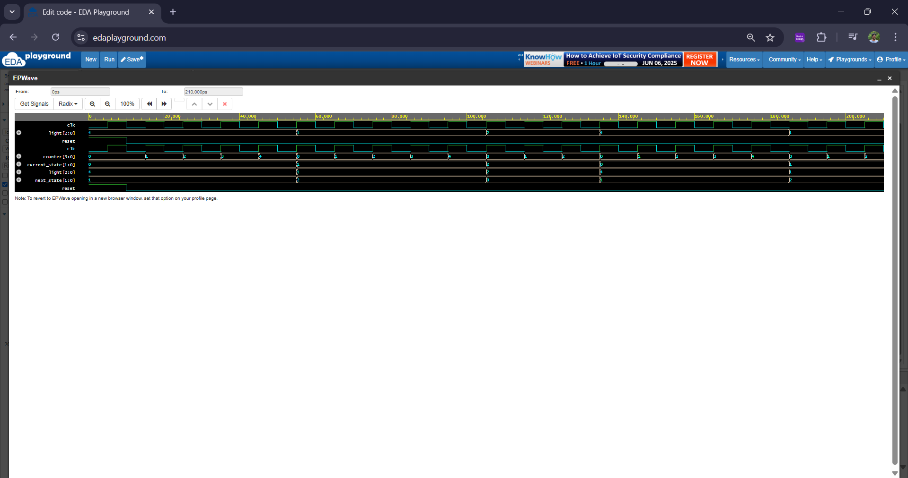

# Traffic Light Controller (FSM-Based) - Verilog

## Description
A simple FSM-based traffic light controller using Verilog HDL. It simulates Red → Green → Yellow transitions based on clock cycles.

## Tech Used
- Verilog HDL
- FSM Design
- RTL Simulation
- ModelSim

## Project Structure

traffic_light_fsm_project/
├── traffic_light_controller.v   # Design module
├── traffic_light_tb.v           # Testbench
├── traffic_light.vcd            # Generated waveform (after simulation)
└── README.md                    # Description and usage

## Simulation
- Tested using ModelSim (10ns clock)
- Simulation shows light transitions at regular intervals

## Waveform (Sample)

## Learning Outcomes
- RTL design & FSM logic
- Clock-based state transitions
- Testbench writing for digital systems
